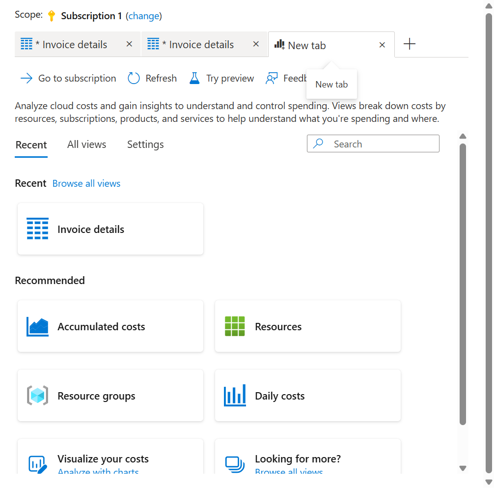
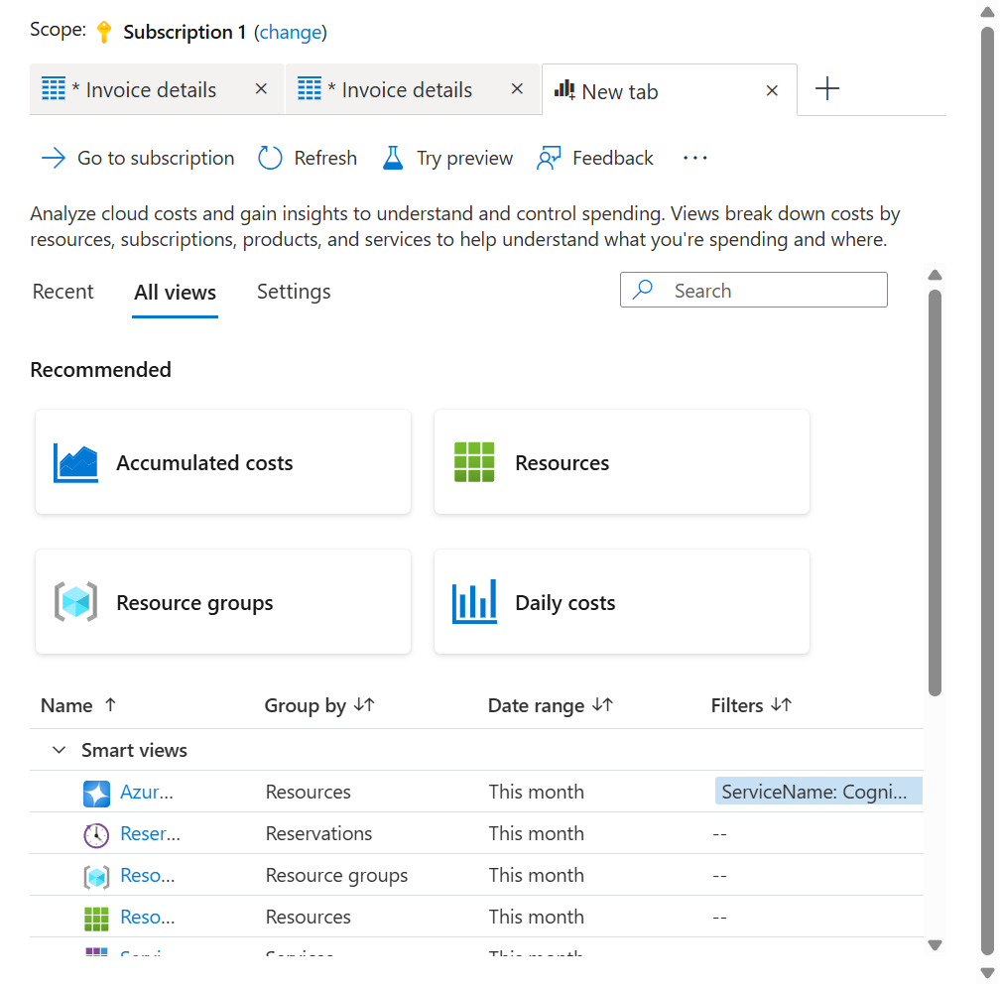
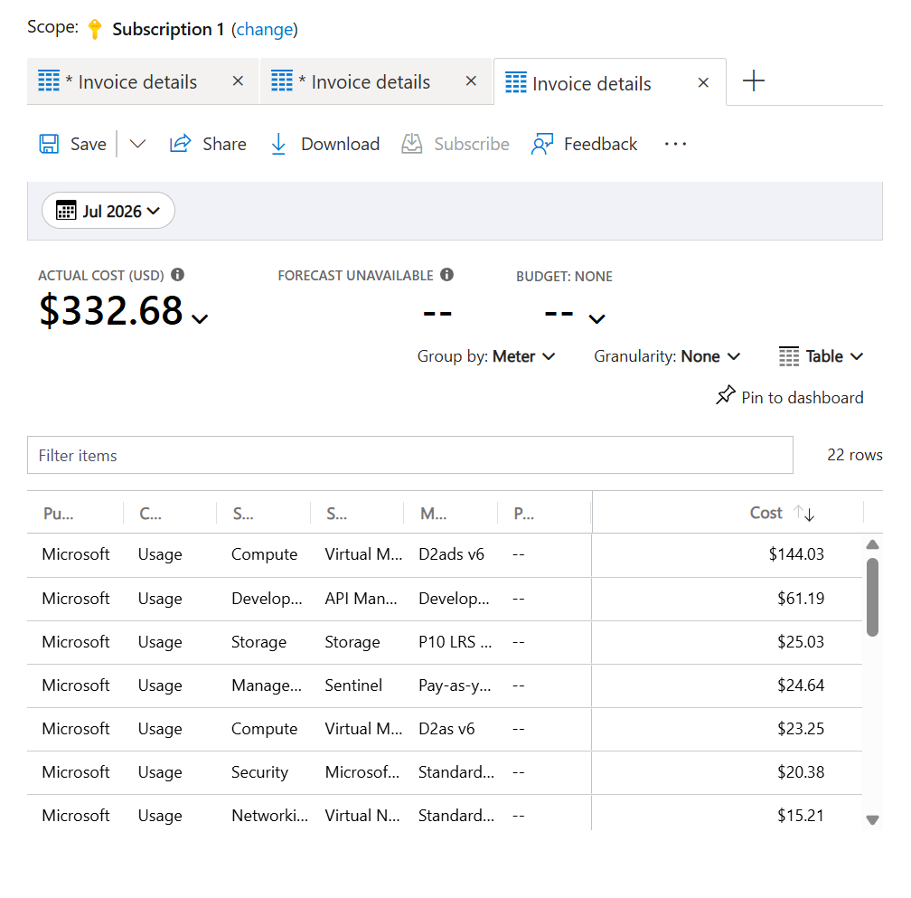
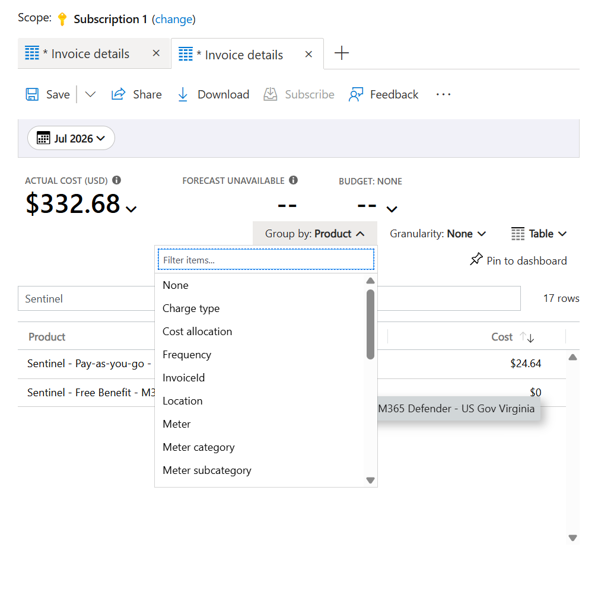
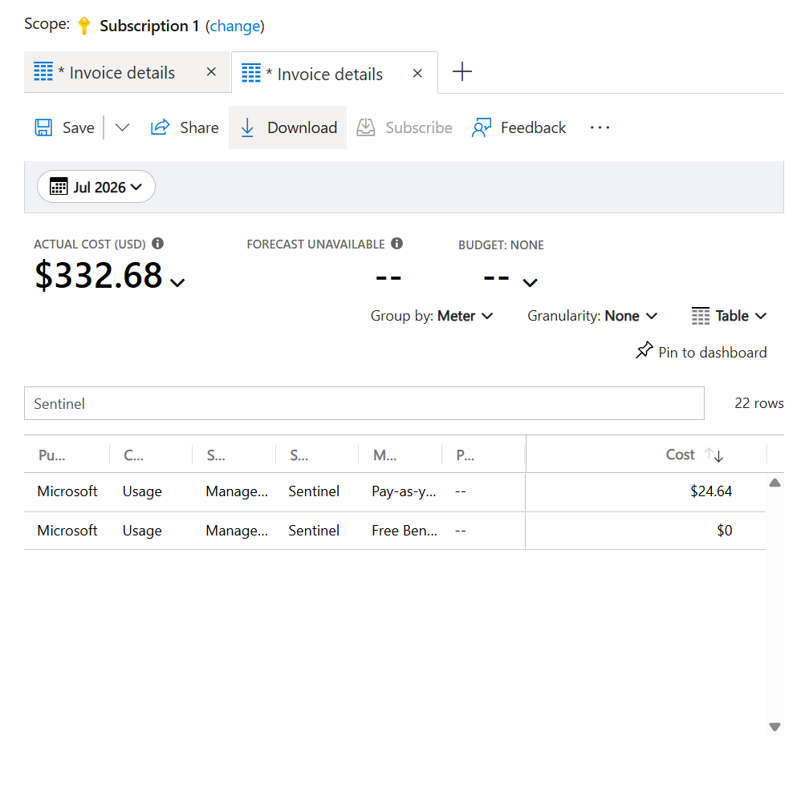
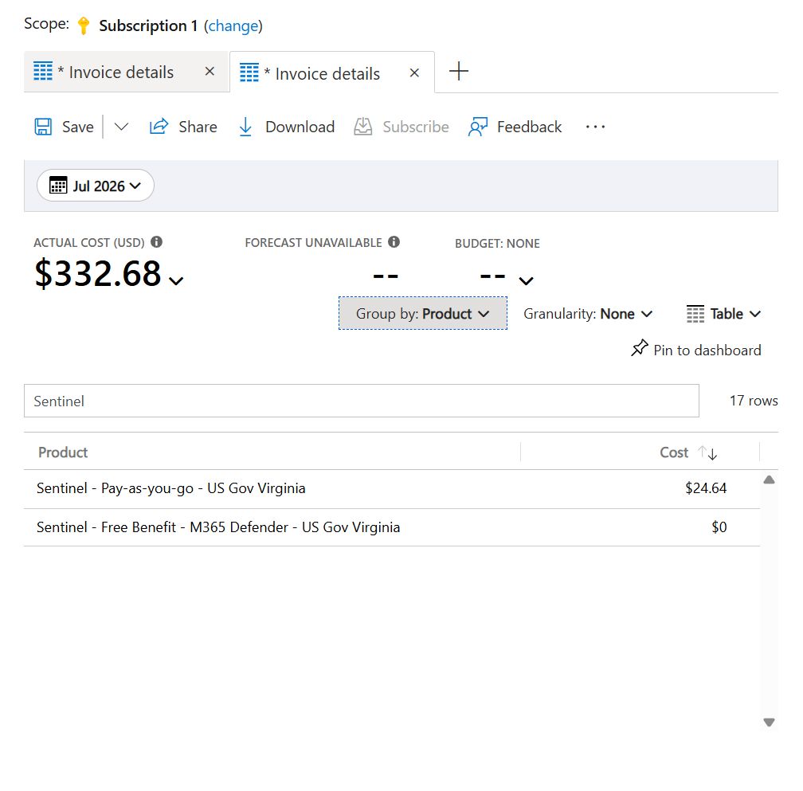
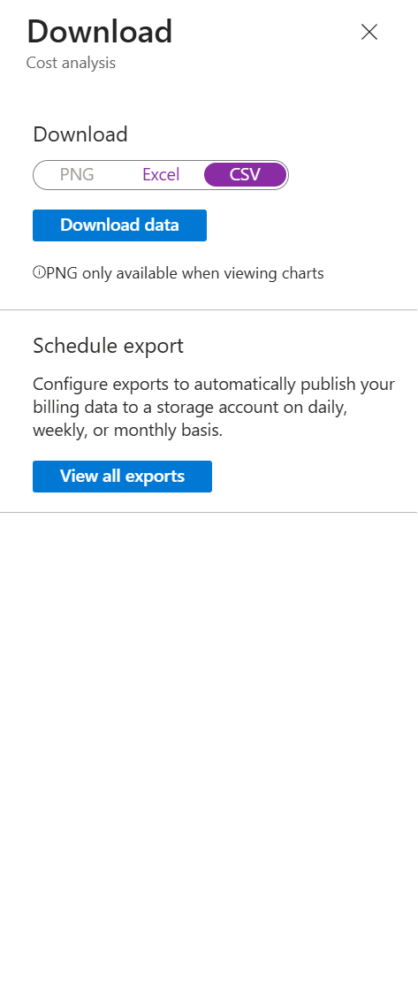

# Find and Export Microsoft Sentinel Billing Meters in Azure Government

> A screenshot-driven walkthrough for identifying the Microsoft Sentinel meter, billing product/SKU label, and actual cost in Azure Government Cost Management, then exporting the result to CSV.

---

## What You Will Get

At the end of this walkthrough, you will have three different billing answers:

| Question | Cost Management dimension | Example from this walkthrough |
|---|---|---|
| What usage meter generated the charge? | **Meter** | `Pay-as-you-go Analysis` |
| What billing product/SKU label appears on the charge? | **Product** | `Sentinel - Pay-as-you-go - US Gov Virginia` |
| What did that meter cost for the selected month? | **Cost** | `$24.64` in the portal |

You will also export a CSV containing the meter-level data used by the report.

> [!IMPORTANT]
> **Pricing tier, Product, and Meter are not interchangeable.** The workspace pricing tier describes how Microsoft Sentinel is priced. **Product** identifies the billed offering and region. **Meter** identifies the specific unit of usage that generated the charge.

---

## Environment Used

This walkthrough was validated in:

- Azure Government portal: `https://portal.azure.us`
- Cost scope: Azure subscription
- Cost Analysis view: **Invoice details**
- Billing period: **July 2026**
- Display currency: **USD**

The screenshots show real portal behavior, but the subscription name and costs are examples. Your values will differ.

## Prerequisites

You need:

- Access to the Azure Government subscription that contains the Microsoft Sentinel workspace.
- Permission to read Cost Management data at the selected scope.
- A month with Microsoft Sentinel usage.
- A modern browser that can download CSV files.

At minimum, use a role that grants access to Cost Management data for the subscription. If the cost blades are empty or unavailable, verify both Azure RBAC and the account's billing-data access policy.

---

## Step 1: Open Cost Analysis

1. Sign in to [Azure Government](https://portal.azure.us).
2. Search for **Cost Management + Billing**.
3. Select the subscription you want to inspect.
4. Under **Cost Management**, select **Cost analysis**.
5. Confirm the scope shown at the top of the page is the intended subscription.
6. Select the **+** button to open a new Cost Analysis tab.

The new tab opens on **Recent** views. If you have used **Invoice details** recently, you can select it here. The repeatable path is through **All views**, which is covered next.



---

## Step 2: Select the Invoice Details View

1. Select **All views**.
2. Find the **Invoice details** row.
3. Open **Invoice details**.

The row describes the default configuration before you open it:

- **Group by:** Meter
- **Date range:** Last month



Why use **Invoice details**? It exposes the dimensions needed for billing reconciliation, including publisher, charge type, service family, service name, meter, part number, and cost.

---

## Step 3: Set the Billing Period

1. Select the date control near the upper-left corner of the report.
2. Choose the month you want to reconcile.
3. Confirm **Group by** is set to **Meter**.
4. Keep **Granularity** set to **None** for a monthly meter total.
5. Keep the visualization set to **Table**.

In this example, **Jul 2026** contains `$332.68` in total subscription cost across `22` meter rows.



> [!NOTE]
> The large **Actual cost** value is the total for the selected scope and period. It is not the Microsoft Sentinel total until the data is filtered or isolated.

---

## Step 4: Understand the Group By Choices

Open **Group by** to change the question that the report answers.

Use these two dimensions for this workflow:

| Dimension | What it tells you | Example |
|---|---|---|
| **Meter** | The usage category that generated the charge | `Pay-as-you-go Analysis` |
| **Product** | The billed product/SKU-style label and region | `Sentinel - Pay-as-you-go - US Gov Virginia` |



Other dimensions can answer different questions, but they do not replace Meter or Product for this reconciliation.

---

## Step 5: Find the Microsoft Sentinel Meters

1. Set **Group by** to **Meter**.
2. In **Filter items**, enter `Sentinel`.
3. Read the rows where **Service name** is **Sentinel**.

This walkthrough produced two Sentinel meters:

| Meter | Charge type | Service family | Cost |
|---|---|---|---:|
| `Pay-as-you-go Analysis` | Usage | Management and Governance | `$24.64` |
| `Free Benefit - M365 Defender Analysis` | Usage | Management and Governance | `$0` |



The paid meter is the important reconciliation row. The free-benefit row shows Microsoft 365 Defender data analysis that was included at no additional charge for the selected period.

> [!WARNING]
> **Filter items is a display filter, not a reliable export filter.** It narrows the rows visible in the table, but the download can still contain every meter in the report. In this example, the table displayed two Sentinel rows while the report still indicated `22 rows`, and the downloaded CSV contained all 22 meter rows.

---

## Step 6: Find the Billing Product/SKU Label

1. Open **Group by**.
2. Select **Product**.
3. Keep `Sentinel` in **Filter items**.

The Product view shows the complete billing labels:

| Product | Cost |
|---|---:|
| `Sentinel - Pay-as-you-go - US Gov Virginia` | `$24.64` |
| `Sentinel - Free Benefit - M365 Defender - US Gov Virginia` | `$0` |



The paid product label is the closest Cost Analysis equivalent to the requested Sentinel billing SKU. It includes both the pricing model and Azure Government region.

---

## Step 7: Return to Meter Before Exporting

Before downloading:

1. Open **Group by** again.
2. Select **Meter**.
3. Confirm the selected month is still correct.
4. Confirm the table shows the meter columns.

Meter is the most useful export grouping for reconciliation because the resulting CSV includes:

- `PublisherType`
- `ChargeType`
- `ServiceFamily`
- `ServiceName`
- `Meter`
- `PartNumber`
- `CostUSD`
- `Cost`
- `Currency`

---

## Step 8: Download the CSV

1. Select **Download** in the report toolbar.
2. Select **CSV**.
3. Select **Download data**.



This is a one-time snapshot of the summarized Cost Analysis table. It is different from **View all exports**, which creates a scheduled export to an Azure Storage account.

Use the right option for the job:

| Requirement | Use |
|---|---|
| One-time investigation or evidence attachment | **Download data** |
| Daily, weekly, or monthly delivery | **View all exports** |
| Raw data or larger recurring datasets | Scheduled **Export** |

Microsoft documents a `15,000`-record limit for CSV files downloaded from the Cost Analysis experience. Use a scheduled export when the dataset is large or must be complete and repeatable.

---

## Step 9: Isolate Sentinel Rows in the CSV

Because **Filter items** does not constrain the downloaded file, filter the CSV after download.

### Excel

1. Open the CSV in Excel.
2. Enable filters on the header row.
3. Filter `ServiceName` to `Sentinel`.
4. Review `Meter`, `CostUSD`, and `Currency`.

### PowerShell

```powershell
$sourcePath = "$HOME\Downloads\Azure-Cost-Meters.csv"
$outputPath = "$HOME\Downloads\Sentinel-Cost-Meters.csv"

$sentinelMeters = Import-Csv -Path $sourcePath |
    Where-Object ServiceName -eq "Sentinel"

$sentinelMeters |
    Select-Object ServiceName, Meter, CostUSD, Currency |
    Format-Table -AutoSize

$sentinelMeters |
    Export-Csv -Path $outputPath -NoTypeInformation
```

Expected shape:

```text
ServiceName  Meter                                  CostUSD          Currency
-----------  -----                                  -------          --------
Sentinel     Free Benefit - M365 Defender Analysis  0                USD
Sentinel     Pay-as-you-go Analysis                 24.63517845176   USD
```

The portal rounds the paid row to `$24.64`; the CSV retains the more precise cost value.

---

## Reading the Result Correctly

The final interpretation for this example is:

```text
Workspace pricing model: Pay-as-you-go
Billing product:         Sentinel - Pay-as-you-go - US Gov Virginia
Paid meter:              Pay-as-you-go Analysis
Paid meter cost:         24.63517845176 USD (displayed as $24.64)
Free meter:              Free Benefit - M365 Defender Analysis
Free meter cost:         0 USD
```

This gives finance, security operations, and cloud engineering a common vocabulary:

- The **workspace pricing model** explains the commercial tier.
- The **Product** value identifies the billed Sentinel offer and region.
- The **Meter** value identifies the charge-producing usage category.
- The **CSV cost** is the precise amount used for reconciliation.

---

## Common Mistakes

### Treating Filter Items as an Export Filter

It is not. Always validate the downloaded CSV and filter `ServiceName` after download.

### Exporting While Grouped by Product

Product is excellent for identifying the SKU-style billing label, but Meter provides the more useful reconciliation schema. Return to **Meter** before downloading.

### Reading Total Actual Cost as Sentinel Cost

The large total at the top covers the selected scope. Use the Sentinel rows in the table or CSV for the Sentinel amount.

### Looking Only for Log Analytics

Depending on the Microsoft Sentinel pricing model and billing configuration, relevant charges can appear under Sentinel, Log Analytics, or Azure Monitor. Microsoft recommends considering all three service names when analyzing Sentinel costs broadly.

### Using a One-Time Download for an Ongoing Process

A downloaded CSV is a point-in-time snapshot. Use scheduled Cost Management exports for repeatable finance or showback workflows.

---

## Quick Checklist

- [ ] Open Azure Government Cost Management at the correct subscription scope.
- [ ] Open **Cost analysis** and select **Invoice details**.
- [ ] Set the correct billing month.
- [ ] Group by **Meter** and identify Sentinel meter rows.
- [ ] Group by **Product** and record the full product/SKU label.
- [ ] Return to **Meter**.
- [ ] Download as **CSV**.
- [ ] Filter the downloaded `ServiceName` column to `Sentinel`.
- [ ] Record the precise `CostUSD` value and currency.
- [ ] Use scheduled exports for recurring or large-scale reporting.

---

## Microsoft References

- [Manage and monitor costs for Microsoft Sentinel](https://learn.microsoft.com/azure/sentinel/billing-monitor-costs)
- [Quickstart: Start using Cost Analysis](https://learn.microsoft.com/azure/cost-management-billing/costs/quick-acm-cost-analysis)
- [Save and share customized Cost Analysis views](https://learn.microsoft.com/azure/cost-management-billing/costs/save-share-views)
- [Azure Monitor cost and usage](https://learn.microsoft.com/azure/azure-monitor/fundamentals/cost-usage)
- [Create and manage Cost Management exports](https://learn.microsoft.com/azure/cost-management-billing/costs/tutorial-improved-exports)

---

## Final Answer From the Walkthrough

For July 2026 in the tested Azure Government subscription:

- **Pricing model:** Pay-as-you-go
- **Billing product/SKU label:** `Sentinel - Pay-as-you-go - US Gov Virginia`
- **Paid meter:** `Pay-as-you-go Analysis`
- **Paid cost:** `$24.64` in the portal, `24.63517845176 USD` in the CSV
- **Included benefit meter:** `Free Benefit - M365 Defender Analysis`
- **Included benefit cost:** `$0`

That is the complete UI-to-CSV path for identifying and exporting Microsoft Sentinel billing meters in Azure Government.