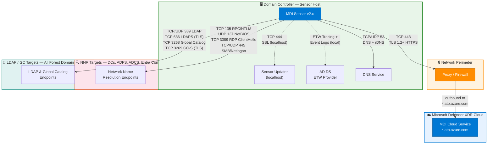

# Microsoft Defender for Identity — Sensor v2.x Data Flows

> **Scope:** MDI standalone sensor v2.x installed directly on Domain Controllers  
> **Reference:** [Microsoft Learn — MDI Prerequisites](https://learn.microsoft.com/en-us/defender-for-identity/prerequisites)  
> **Last Updated:** February 2026

---

## Architecture Diagram



---

## Complete Port Reference

### 1. Cloud Connectivity (Outbound)

| Port | Protocol | Transport | Direction | Destination | TLS | Purpose |
|------|----------|-----------|-----------|-------------|-----|---------|
| **443** | HTTPS | TCP | Outbound | `*.atp.azure.com` | TLS 1.2+ required | Sensor ↔ MDI cloud service communication, telemetry upload, detection signals, entity data sync |

- **Proxy support:** HTTP proxy with CONNECT tunneling; transparent proxy with certificate inspection
- **Alternative:** Azure ExpressRoute with Microsoft peering, BGP community `12076:5220`
- **Cert pinning:** None — standard TLS CA validation

### 2. Sensor Internal Services (localhost)

| Port | Protocol | Transport | Direction | Destination | TLS | Purpose |
|------|----------|-----------|-----------|-------------|-----|---------|
| **444** | SSL | TCP | Localhost | `127.0.0.1` | SSL (self-signed) | Sensor updater service — downloads and installs sensor updates |

### 3. Local Data Collection

| Source | Transport | Direction | Mechanism | Purpose |
|--------|-----------|-----------|-----------|---------|
| **AD DS** | Local IPC | Local | ETW tracing + Windows Event Logs | Captures authentication events (4624, 4625, 4768, 4769, 4776), directory changes, Kerberos/NTLM traffic |
| **DNS Server** | TCP/UDP 53 | Local/Network | DNS query interception + rDNS lookups | DNS-based threat detection, domain resolution for NNR |

### 4. Network Name Resolution (NNR)

| Port | Protocol | Transport | Direction | Targets | Purpose |
|------|----------|-----------|-----------|---------|---------|
| **135** | RPC/NTLM | TCP | Outbound | DCs, ADFS, ADCS, Entra Connect | RPC endpoint mapper — NTLM-based name resolution |
| **137** | NetBIOS | UDP | Outbound | DCs, ADFS, ADCS, Entra Connect | NetBIOS name resolution (legacy fallback) |
| **3389** | RDP | TCP | Outbound | DCs, ADFS, ADCS, Entra Connect | RDP ClientHello packet parsing — extracts machine identity without full RDP session |
| **445** | SMB | TCP/UDP | Outbound | DCs, ADFS, ADCS, Entra Connect | SMB session enumeration, Netlogon for lateral movement detection |

> **NNR priority order:** RPC (135) → NetBIOS (137) → RDP (3389) → DNS rDNS (53)

### 5. LDAP / Global Catalog Queries

| Port | Protocol | Transport | Direction | Targets | TLS | Purpose |
|------|----------|-----------|-----------|---------|-----|---------|
| **389** | LDAP | TCP/UDP | Outbound | All forest DCs | Optional (LDAP signing) | Standard LDAP queries — user/group/computer enumeration, entity enrichment |
| **636** | LDAPS | TCP | Outbound | All forest DCs | TLS required | Secure LDAP queries — encrypted directory lookups |
| **3268** | LDAP GC | TCP | Outbound | Global Catalog servers | Optional | Global Catalog read queries — cross-domain entity resolution |
| **3269** | LDAPS GC | TCP | Outbound | Global Catalog servers | TLS required | Secure Global Catalog queries — encrypted cross-domain lookups |

---

## Firewall Rule Summary

### Required Outbound Rules

```
ALLOW TCP 443   → *.atp.azure.com                  # MDI cloud (REQUIRED)
ALLOW TCP 444   → 127.0.0.1 (localhost only)        # Sensor updater
ALLOW TCP/UDP 53 → DNS servers                       # DNS resolution
ALLOW TCP 135   → DCs, ADFS, ADCS, Entra Connect    # NNR - RPC
ALLOW UDP 137   → DCs, ADFS, ADCS, Entra Connect    # NNR - NetBIOS
ALLOW TCP 3389  → DCs, ADFS, ADCS, Entra Connect    # NNR - RDP
ALLOW TCP/UDP 445 → DCs, ADFS, ADCS, Entra Connect  # SMB/Netlogon
ALLOW TCP/UDP 389 → All forest DCs                   # LDAP
ALLOW TCP 636   → All forest DCs                     # LDAPS
ALLOW TCP 3268  → Global Catalog servers              # LDAP GC
ALLOW TCP 3269  → Global Catalog servers              # LDAPS GC
```

> **Note:** All flows are outbound or localhost. No inbound firewall rules are required.

---

## gMSA Service Account

The MDI sensor service runs under a **Group Managed Service Account (gMSA)**. This does not introduce additional network ports — gMSA password retrieval operates through the existing **LDAP (389/636)** and **Kerberos (88)** paths to Domain Controllers.

| Setting | Value |
|---------|-------|
| Account type | gMSA (Group Managed Service Account) |
| Password rotation | Automatic (30-day default via AD DS) |
| Authentication | Kerberos — DC retrieves password from AD via existing LDAP/Kerberos channels |
| Configuration | Assigned during sensor installation or via MDI portal |
| Benefit | No manual password management, reduced credential exposure |

> With gMSA, SAM-R queries are deprecated. The sensor uses the gMSA to authenticate LDAP lookups and access remote resources on NNR targets. All traffic flows through ports already documented above.

---

## ExpressRoute Alternative

For environments using Azure ExpressRoute instead of public internet:

| Setting | Value |
|---------|-------|
| Peering type | Microsoft peering |
| BGP community | `12076:5220` |
| Service | Microsoft Defender for Identity |
| Protocol | HTTPS (TCP 443) |

> ExpressRoute replaces the TCP 443 outbound path only. All other ports remain internal network flows.

---

## Detection Categories by Port

| Port(s) | Detections Enabled |
|---------|-------------------|
| 443 | All cloud-side detections, entity behavioral analytics, UEBA |
| ETW/Event Logs | Pass-the-Hash, Pass-the-Ticket, Kerberoasting, Golden Ticket, Brute Force |
| 53 | DNS tunneling, DNS reconnaissance, suspicious DNS queries |
| 135, 137, 3389 | Network Name Resolution for lateral movement path mapping |
| 445 | Lateral movement (SMB), SAM-R reconnaissance, remote execution |
| 389, 636, 3268, 3269 | Directory enumeration, DCShadow, suspicious replication, LDAP reconnaissance |
