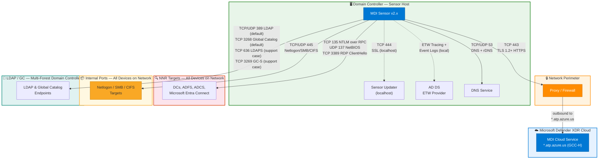

# Microsoft Defender for Identity — Sensor v2.x Data Flows

> **Scope:** MDI sensor v2.x installed directly on Domain Controllers  
> **Reference:** [MDI Prerequisites](https://learn.microsoft.com/en-us/defender-for-identity/prerequisites) | [NNR Policy](https://learn.microsoft.com/en-us/defender-for-identity/nnr-policy) | [DSA Accounts](https://learn.microsoft.com/en-us/defender-for-identity/directory-service-accounts) | [SAM-R (Deprecated)](https://learn.microsoft.com/en-us/defender-for-identity/remote-calls-sam)  
> **Last Updated:** February 2026  
> **Cloud:** Azure Government (GCC-H) — sensor endpoint `*.atp.azure.us`

---

## Architecture Diagram



---

## Complete Port Reference

### 1. Cloud Connectivity (Outbound)

| Port | Protocol | Transport | Direction | Destination | TLS | Purpose |
|------|----------|-----------|-----------|-------------|-----|---------|
| **443** | HTTPS (SSL) | TCP | Outbound | `*.atp.azure.us` (GCC-H) | TLS 1.2+ required | Sensor ↔ MDI cloud service communication, telemetry upload, detection signals, entity data sync |

- **GCC:** `*.gcc.atp.azure.com` / **GCC-H & DoD:** `*.atp.azure.us` / **Commercial:** `*.atp.azure.com`
- **Proxy support:** HTTP proxy with CONNECT tunneling; transparent proxy (SSL inspection not supported)
- **Alternative:** Azure ExpressRoute with Microsoft peering, BGP community `12076:5220`
- **Service tag:** `AzureAdvancedThreatProtection` (for firewall IP allowlisting)

### 2. Sensor Internal Services (localhost)

| Port | Protocol | Transport | Direction | Destination | TLS | Purpose |
|------|----------|-----------|-----------|-------------|-----|---------|
| **444** | SSL | TCP | Localhost | `127.0.0.1` | SSL (self-signed) | Sensor updater service — downloads and installs sensor updates |

### 3. Local Data Collection

| Source | Transport | Direction | Mechanism | Purpose |
|--------|-----------|-----------|-----------|---------|
| **AD DS** | Local IPC | Local | ETW tracing + Windows Event Logs | Captures authentication events (4624, 4625, 4768, 4769, 4776), directory changes, Kerberos/NTLM traffic |
| **DNS Server** | TCP/UDP 53 | Local/Network | DNS query interception + rDNS lookups | DNS-based threat detection, domain resolution for NNR |

### 4. Network Name Resolution (NNR)

NNR ports resolve IP addresses to computer names. These are categorized separately from Internal ports in the [docs](https://learn.microsoft.com/en-us/defender-for-identity/nnr-policy).

| Port | Protocol | Transport | Direction | Targets | Purpose |
|------|----------|-----------|-----------|---------|---------|
| **135** | NTLM over RPC | TCP | Outbound | All devices on network (DCs, ADFS, ADCS, and Microsoft Entra Connect) | NTLM-based name resolution |
| **137** | NetBIOS | UDP | Outbound | All devices on network (DCs, ADFS, ADCS, and Microsoft Entra Connect) | NetBIOS name resolution |
| **3389** | RDP | TCP | Outbound | All devices on network (DCs, ADFS, ADCS, and Microsoft Entra Connect) | Only the first packet of **Client hello** — extracts machine identity, no full RDP session |

> **NNR primary methods:** NTLM over RPC (135) → NetBIOS (137) → RDP (3389)  
> **NNR secondary method:** Reverse DNS lookup (UDP 53) — used only when no primary method responds or results conflict  
> **Note:** Only one primary method is required, but all are recommended. No authentication is performed on any NNR port.

### 5. Internal Ports

| Port | Protocol | Transport | Direction | Targets | Purpose |
|------|----------|-----------|-----------|---------|---------|
| **445** | Netlogon (SMB, CIFS) | TCP/UDP | Outbound | All devices on the network (DCs, ADFS, ADCS, and Microsoft Entra Connect) | Netlogon, SMB session enumeration, CIFS |

### 6. LDAP / Global Catalog Queries (Multi-Forest)

These ports are required when working with **multiple forests**. They must be open on any machine where an MDI sensor is installed.

| Port | Protocol | Transport | Direction | Targets | TLS | Default | Purpose |
|------|----------|-----------|-----------|---------|-----|---------|--------|
| **389** | LDAP | TCP/UDP | Outbound | Domain controllers | Optional (LDAP signing) | **Yes** | Standard LDAP queries — user/group/computer enumeration, entity enrichment, DSA connectivity |
| **3268** | LDAP GC | TCP | Outbound | Global Catalog servers | Optional | **Yes** | Global Catalog read queries — cross-domain entity resolution |
| **636** | LDAPS | TCP | Outbound | Domain controllers | TLS required | **No** (support case) | Secure LDAP — requires opening a [support case](https://learn.microsoft.com/en-us/defender-for-identity/support) to enable |
| **3269** | LDAPS GC | TCP | Outbound | Global Catalog servers | TLS required | **No** (support case) | Secure Global Catalog — requires opening a support case to enable |

> **Important:** By default, sensors query using LDAP on ports **389** and **3268**. To switch to LDAPS on ports 636 and 3269, you must open a Microsoft support case.

---

## Firewall Rule Summary

### Required Outbound Rules

```
ALLOW TCP 443   → *.atp.azure.us                   # MDI cloud GCC-H (REQUIRED)
ALLOW TCP 444   → 127.0.0.1 (localhost only)        # Sensor updater
ALLOW TCP/UDP 53 → DNS servers                       # DNS resolution
ALLOW TCP 135   → All devices on network             # NNR - NTLM over RPC
ALLOW UDP 137   → All devices on network             # NNR - NetBIOS
ALLOW TCP 3389  → All devices on network             # NNR - RDP (ClientHello only)
ALLOW TCP/UDP 445 → All devices on network           # Netlogon/SMB/CIFS
ALLOW TCP/UDP 389 → Domain controllers (multi-forest) # LDAP (default)
ALLOW TCP 3268  → Global Catalog servers              # LDAP GC (default)
# ALLOW TCP 636 → Domain controllers                  # LDAPS (requires support case)
# ALLOW TCP 3269 → Global Catalog servers              # LDAPS GC (requires support case)
```

> **Note:** All flows are outbound or localhost. No inbound firewall rules are required.

---

## Directory Service Account (gMSA)

The MDI sensor service itself runs under **LocalService** (updater under **LocalSystem**). The **gMSA** is configured as the **Directory Service Account (DSA)** — the identity the sensor uses to query Active Directory.

| Setting | Value |
|---------|-------|
| Account type | gMSA (Group Managed Service Account) — **recommended** by Microsoft |
| Role | Directory Service Account (DSA) — used for LDAP queries, entity enrichment, domain/trust mapping |
| Password rotation | Automatic — managed by AD DS (no manual password management) |
| Authentication | Kerberos — password retrieved from AD via existing LDAP/Kerberos channels |
| Permissions required | Read-only on all AD objects, including the `Deleted Objects` container |
| Configuration | Assigned during sensor installation or via Defender XDR portal |

> **SAM-R Deprecation:** As of **May 2025**, Microsoft Defender for Identity **no longer collects local administrator group members via SAM-R queries** for any DSA type (gMSA, regular account, or local service). This change was applied automatically — no administrative action required. Lateral movement path (LMP) maps are no longer updated via SAM-R. Port 445 remains required for Netlogon/SMB/CIFS but is no longer used for SAM-R enumeration. ([Source](https://learn.microsoft.com/en-us/defender-for-identity/remote-calls-sam))

---

## ExpressRoute Alternative

For environments using Azure ExpressRoute instead of public internet:

| Setting | Value |
|---------|-------|
| Peering type | Microsoft peering |
| BGP community | `12076:5220` |
| Service | Microsoft Defender for Identity |
| Protocol | HTTPS (TCP 443) |

> ExpressRoute replaces the TCP 443 outbound path only. All other ports remain internal network flows.

---

## Detection Categories by Port

| Port(s) | Detections Enabled |
|---------|-------------------|
| 443 | All cloud-side detections, entity behavioral analytics, UEBA |
| ETW/Event Logs | Pass-the-Hash, Pass-the-Ticket, Kerberoasting, Golden Ticket, Brute Force |
| 53 | DNS tunneling, DNS reconnaissance, suspicious DNS queries |
| 135, 137, 3389 | Network Name Resolution for lateral movement path mapping |
| 445 | Netlogon, SMB session enumeration, CIFS (SAM-R deprecated May 2025) |
| 389, 636, 3268, 3269 | Directory enumeration, DCShadow, suspicious replication, LDAP reconnaissance |
